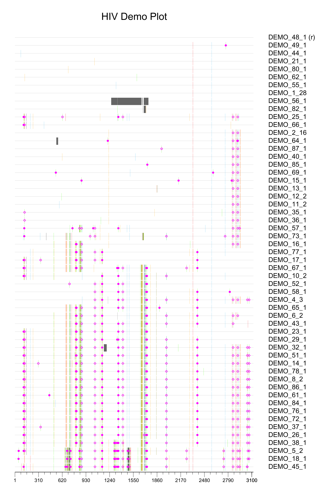

# Highlighter
Hilighter is a pure Python extension to [Biopython](https://github.com/biopython/biopython) to detect point mutations in the members of a sequence alignment, and to plot either matching or mismatched nucleotides or amino acids.  It's written with a focus on adjustable formatting.

This is a rewrite of the excelent web based [LANL Highlighter ](https://www.hiv.lanl.gov/content/sequence/HIGHLIGHT/highlighter_top.html) tool.

It is currently needing more documentation before it gets submitted to Biopython, so is monkey patching at the moment.  My hope is that it will be part of the standard Biopython at some point.

